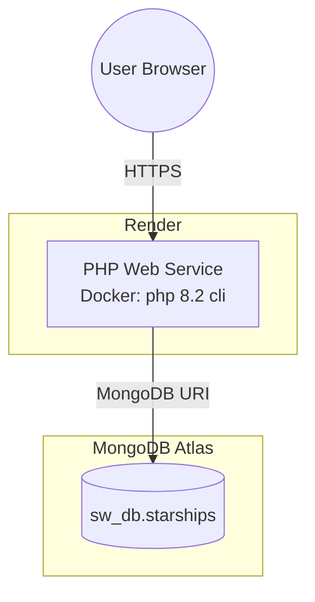
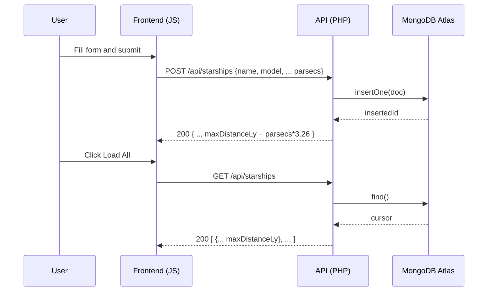

# Architecture — Star Wars Starships (Render + MongoDB Atlas + PHP)

This system is a simple cloud-hosted web app that stores Star Wars starships in MongoDB Atlas and computes the maximum distance in light-years from parsecs (1 parsec = 3.26 ly). It is intentionally minimal to meet the exam requirement of a web client and a PHP page that persists to a cloud database.

## Components
- Frontend (SPA): Static HTML/CSS/JS served by the same service (`public/`).
- Backend (PHP): REST-like endpoint `public/api/starships.php` handling `GET` and `POST`.
- Database: MongoDB Atlas (`sw_db.starships`).
- Hosting: Render Web Service (Dockerfile).

## Deployment Topology (Mermaid)


## Sequence — Insert and List


## Data Model (Collection: `starships`)
- `_id: ObjectId`
- `name: string`
- `model: string`
- `manufacturer: string`
- `maxDistanceParsec: number`
- `hyperdriveRating: number`
- Metadata: `createdAt: Date` (added server-side)

Computed field returned by the API: `maxDistanceLy = round(maxDistanceParsec * 3.26, 2)`

## Endpoints
- `GET /api/starships.php` → list all
- `GET /api/starships.php?name=Falcon` → case-insensitive search by name
- `POST /api/starships.php` → insert one starship

Request (POST)
```json
{
  "name": "Millennium Falcon",
  "model": "YT-1300f",
  "manufacturer": "Corellian Engineering Corporation",
  "maxDistanceParsec": 12.0,
  "hyperdriveRating": 0.5
}
```
Response always includes
```json
{
  "maxDistanceLy": 39.12
}
```

## Environment and Secrets
- `MONGODB_URI`: Atlas connection string (set in Render)
- `DB_NAME`: `sw_db`
- `COLLECTION_NAME`: `starships`

## Mapping to Your UI Mockup
- Toolbar: Load All / Find by Name input maps to `GET` endpoints.
- Form fields: Name, Model, Manufacturer, Hyperdrive Rating, Max Distance (parsecs) map to POST body.
- Live computed label: Frontend shows `parsecs * 3.26`; API recomputes to ensure consistency.
- Table: Displays `name | model | manufacturer | hyperdrive | max parsecs | light-years`.

## Notes and Alternatives
- Alternative split-front architecture: host the frontend as a Render Static Site and the API as a second Render Web Service. Enable CORS on the PHP endpoint (already added with `Access-Control-Allow-Origin: *`).
- If you prefer Node in the backend later, you can swap the API component while keeping Atlas and the frontend unchanged.
